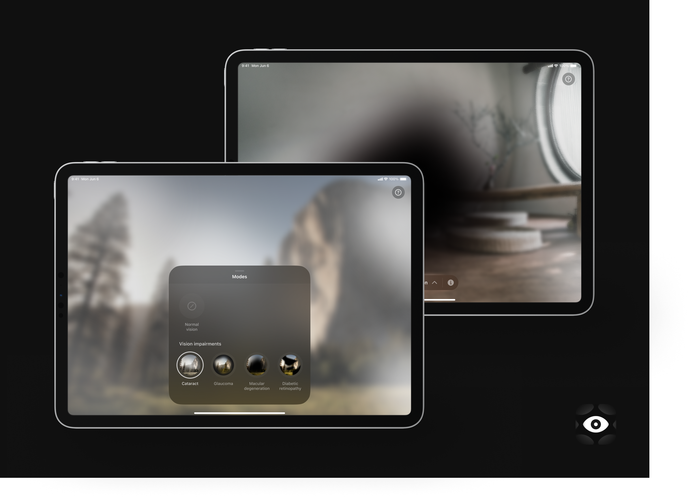

# Ochi

**Ochi** is vision impairments simulator which covers the most common impairments, e.g. glaucoma, cataracts, astigmatism and different forms of color blindness.

## Swift Student Challenge
This app was developed for the WWDC24 Swift Student Challenge and won in the contest. 

## Technologies
The app's interface is built with SwiftUI. To address performance issues and meet the challenge's requirements, the camera view is implemented using MTKView. This view receives camera input and applies a Metal shader.

Each visual impairment mode in Ochi features a custom, finely-tuned shader to create realistic effects. For instance, the Macular Degeneration mode includes a slight image swirl to simulate the real-life manifestation of the impairment.

